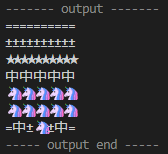

# NextRJ Utilities

The utilities for `path`, `string`, `duration`.

## Usage

### Object functions

```ts
import { recursiveAssign } from "https://deno.land/x/nextrj_utils@$VERSION/object.js"
const obj1 = { id: 1, name: "test1", nested: { num: 1, keep: true } }
const obj2 = { name: "test2", nested: { num: 2, ext: "more" } }
const obj3 = recursiveAssign({}, obj1, obj2)
console.log(obj3) // { id: 1, name: "test2", nested: { num: 2, keep: true, ext: "more" } }
```

### JsonP functions

```ts
import { parse } from "https://deno.land/x/nextrj_utils@$VERSION/jsonp.ts"
const j = parse("jsonpCallbackName({ok: true})") as Record<string, boolean>
assertStrictEquals(j.ok, true)
```

### Path functions

```ts
import { exists, existsSync } from "https://deno.land/x/nextrj_utils@$VERSION/path.ts"
const pathExists = await exists("./foo/bar")
const pathExistsSync = existsSync("./foo/bar")
console.log(pathExists) // true or false
console.log(pathExistsSync) // true or false
```

### String functions

**Format string template:**

```ts
import { assertStrictEquals } from "https://deno.land/std@$STD_VERSION/testing/asserts.ts"
import { format } from "https://deno.land/x/nextrj_utils@$VERSION/string.ts"

assertStrictEquals(format("${a} / ${b}", { a: 50, b: 100 }), "50 / 100")

const f = (v: number): number => ++v
assertStrictEquals(format("${v}-${f(1)}", { v: 1, f }), "1-2")
```

**Truncate filename:**

```ts
import { assertStrictEquals } from "https://deno.land/std@$STD_VERSION/testing/asserts.ts"
import { truncateFilename } from "https://deno.land/x/nextrj_utils@$VERSION/string.ts"

truncateFilename("123456789.zip", 10) // "12...9.zip"
// 🦄 is 2 column width
truncateFilename("1234567🦄.zip", 10) // "1...🦄.zip"
```

**Truncate string:**

```ts
import { truncate } from "https://deno.land/x/nextrj_utils@$VERSION/string.ts"

const maxLen = 10
// defaults truncate by max-column-count for better match visable with.
console.log(truncate("=".repeat(1000), maxLen))
console.log(truncate("±".repeat(1000), maxLen))
console.log(truncate("★".repeat(1000), maxLen))
console.log(truncate("中".repeat(1000), maxLen))
console.log(truncate("🦄".repeat(1000), maxLen))
console.log(truncate("🦄".repeat(1000), maxLen))
console.log(truncate("=中±🦄±中=".repeat(1000), maxLen))

// they should all have the very similar visable width in the terminal:
```



### Format seconds to duration

```ts
import { assertStrictEquals } from "https://deno.land/std@$STD_VERSION/testing/asserts.ts"
import { format } from "https://deno.land/x/nextrj_utils@$VERSION/duration.ts"

// mm:ss
assertStrictEquals(format(15), "00:15")
assertStrictEquals(format(2 * 60 + 15), "02:15")

// hh:mm:ss
assertStrictEquals(format(13 * 60 * 60 + 2 * 60 + 15), "13:02:15")
assertStrictEquals(format(24 * 60 * 60 + 2 * 60 + 15), "24:02:15")
```

### Fetch remote file with progress callback

```ts
import { Fetcher } from "https://deno.land/x/nextrj_utils@$VERSION/file.ts"

const fetcher = new Fetcher(
  "https://www.example.com/test.pdf",
  {
    to: "example-test.pdf",
    on: {
      start(total: number) {
        console.log(`start: total=${total}`)
      },
      received(received: number, total: number) {
        console.log(`received: received=${received}, total=${total}`)
      },
      end(success: boolean) {
        console.log(`end: success=${success}`)
      },
    },
  },
)
await fetcher.fetch()
```
